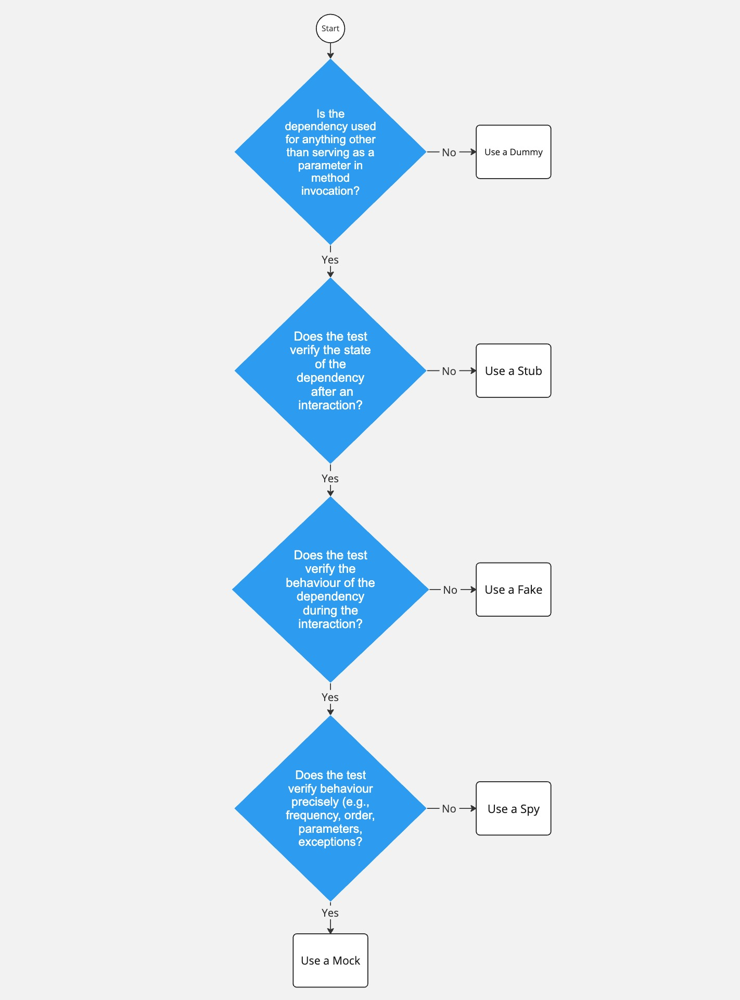

# We Need To Talk About Mocking
- [We Need To Talk About Mocking](#we-need-to-talk-about-mocks)
  - [Intro](#intro)
  - [Test Doubles](#test-doubles)
    - [Definitions](#definitions)
    - [Examples](#examples)
  - [Flowchart](#flowchart)
  - [Comparison Table](#comparison-table)
  - [Questionnaire](#questionnaire)

---

## Intro
<div id='id-intro'/>

We need to talk about mocks. Wait, did you mean stubs? No wait, that's a dummy.

Mocking is a software testing technique primarily used to isolate the system under test from external dependencies such as databases or third-party APIs. Sometimes, it is also used to simplify the testing of complex internal code.

Overuse of mocks can lead to tests that are sensitive to changes<sup>[[1]](https:&#47;&#47;www.codium.ai&#47;blog&#47;mock-testing&#47;)</sup>, tests that fail or pass when they shouldn't<sup>[[2]](https:&#47;&#47;www.accenture.com&#47;us-en&#47;blogs&#47;software-engineering-blog&#47;to-mock-or-not-to-mock-is-that-even-a-question)</sup>, and tests that are harder to understand and maintain<sup>[[3]](https:&#47;&#47;fagnerbrack.com&#47;mocking-can-lean-to-nondeterministic-tests-4ba8aef977a0)</sup>.

But we can't really analyse our mock usage if we can't tell apart mocks from the other test doubles out there.

## Test Doubles
<div id='id-test-doubles'/>

### Definitions
<div id='id-definitions'/>

There are five main types of test doubles:
1. **Dummy**: Dummy objects are passed around but never actually used, their sole purpose is to fulfill method requirements.
2. **Stub**: Stubs return fixed responses, ignoring any calls not defined in the test.
3. **Fake**: Fakes are simplified implementations of the real dependency.
4. **Spy**: Spies monitor method calls, including their frequency and passed arguments.
5. **Mock**: Mocks are pre-set with expectations and can trigger errors when those expectations are not met.

### Examples
<div id='id-examples'/>

> **_NOTE:_** 
> These examples are written using the Mockito framework. In Mockito, the `mock()` method is used to create a mock object of a given class or interface. Whether it is _actually_ a mock will depend on your intentions!
> 
> If you simply use it to satisfy a dependency and don't configure it or validate its interactions, it's a **dummy**.
> 
> If you configure it to return specific values when its methods are called, it's a **stub**.
> 
> If you also validate that specific methods were called on it, it's a **spy**.
>
> If you define expectations on it ahead of time and validate those expectations at the end, it's a **mock**.


#### 1. Dummy

```java
@Test
public void userRegistrationTest() {
    // Arrange
    Logger dummyLogger = mock(Logger.class);

    // Act
    UserService userService = new UserService(dummyLogger);
    boolean registrationSuccess = userService.registerUser("username", "email@example.com");

    // Assert
    assertTrue(registrationSuccess);
}
```

Here, we're testing the user registration process. To instantiate `UserService`, we need to satisfy its `Logger` dependency. However, the `Logger` service isn't used in the `registerUser()` method, which makes a **dummy** object suitable in this case.

#### 2. Stub

```java
@Test
public void userAuthenticationTest() {
    // Arrange
    UserRepository stubUserRepository = mock(UserRepository.class);
    when(stubUserRepository.findByUsername("testUser")).thenReturn(new User("testUser", "testPassword"));

    // Act
    UserService userService = new UserService(stubUserRepository);
    User result = userService.authenticate("testUser", "testPassword");

    // Assert
    assertEquals("testUser", result.getUsername());
}
```

Here, we're testing the user authentication process. To instantiate `UserService`, we need to satisfy its `UserRepository` dependency. Since we're only interested in testing whether the `authenticate()` method successfully returns the correct user, we can use a **stub** for `UserRepository`. The stub is programmed to return a specific user whenever `findByUsername()` is called.

#### 3. Fake

```java
public class FakeInMemoryPostDatabase {
    private Map<String, Post> data = new HashMap<>();

    public Post save(Post post) {
        data.put(post.getId(), post);
        return data.get(post.getId());
    }

    public Post get(String id) {
        return data.get(id);
    }
}
```
This is an example of a fake in-memory database that could be used in a test to simulate the saving and retrieving of posts. Instead of interacting with a real database, which can be complex and slow, we use a simple `HashMap` defined in `FakeInMemoryPostDatabase`, making this test double a **fake**.
#### 4. Spy

```java
@Test
public void emailSendingTest() {
    // Arrange
    EmailService spyEmailService = spy(new EmailService());
    UserService userService = new UserService(spyEmailService);

    // Act
    userService.sendWelcomeEmail("email@example.com");

    // Assert
    verify(spyEmailService).sendEmail("email@example.com", "Welcome");
}
```
In this test, we are checking that a welcome email is sent when a new user is created. We want to verify that the `sendWelcomeEmail()` method in `UserService` invokes the `sendEmail()` method on the `EmailService` dependency with the correct parameters. The `EmailService` is a **spy** in this scenario, as we monitor its interactions during test execution.

#### 5. Mock

```java
@Test
public void userDeletionTest() {
    // Arrange
    UserRepository mockUserRepository = mock(UserRepository.class);
    UserService userService = new UserService(mockUserRepository);

    // Act
    userService.deleteUser("username");

    // Assert
    verify(mockUserRepository, times(1)).deleteByUsername("username");
}
```
In this test, we're verifying that the `deleteUser()` method in `UserService` invokes the `deleteByUsername()` method on the `UserRepository` dependency exactly once (better not call it twice!). As such, the `UserRepository` is a **mock** in this scenario, since we are not just using it to satisfy a dependency or return predetermined responses, but also verifying its specific interactions during test execution.

## Flowchart
<div id='id-flowchart'/>

Here is a simple flowchart that can be used to decide which specific test double should be used in a test:



Of course, your test double choice will often be context-dependent. 

The nature of the system under
test, the requirements of the specific test case, and the overall testing strategy might lead to a different test double choice than suggested in this flowchart.

In some cases, especially for integration tests, the real implementation of the dependency might also be used.


## Comparison Table
<div id='id-comparison-table'/>

This is a simple comparison table which combines the points discussed above.

| Test Double | Purpose                                                                                                                                                   | Advantages                                                                                                                                                          | Disadvantages                                                                                                                                                                                                                       | 
|-------------|-----------------------------------------------------------------------------------------------------------------------------------------------------------|---------------------------------------------------------------------------------------------------------------------------------------------------------------------|-------------------------------------------------------------------------------------------------------------------------------------------------------------------------------------------------------------------------------------|
| Dummy       | <ul><li>passed around but not actually used</li><li>only used to fill parameter lists</li></ul>                                                           | <ul><li>can simplify the testing process by standing in for more complex objects that aren't relevant to the test being performed</li></ul>                         | <ul><li>can't be used to verify behaviour</li><li>less suitable when the parameter is actually used in the method under test</li></ul>                                                                                              |
| Stub        | <ul><li>provides canned answers to calls made during the test</li></ul>                                                                                   | 	<ul><li>can control the indirect inputs to the system under test, making it easier to test in a controlled environment</li></ul>                                   | <ul><li>can't respond to unexpected calls, only to those that they are explicitly programmed for</li><li>can't give feedback if the system under test misbehaves</li></ul>                                                          |
| Fake        | <ul><li>provides working, simplified implementations of real dependencies</li></ul>                                                                       | <ul><li> can simplify testing by replacing complex real-world implementations with simpler, more predictable ones</li></ul>                                  | <ul><li>behaviour of a fake is simpler and less realistic than the real-world system it's standing in for, so tests using fakes can miss problems that would occur in the real system</li></ul>                                     |
| Spy         | <ul><li>can monitor specific method calls and their parameters, while also offering pre-set responses (just like stubs)</li></ul>                         | <ul><li> can give you detailed insight into how a system is behaving by recording its interactions with dependencies</li></ul>                                      | <ul><li>can lead to brittle tests if used improperly, as they make tests dependent on the specific implementation details of the system under test</li></ul>                                                                        |
| Mock        | <ul><li>can validate system interactions with dependencies by being pre-programmed with expectations, and raise exceptions for unexpected calls</li></ul> | <ul><li> can be a powerful tool when used correctly, as they can stand in for dependencies and verify that the system under test is behaving correctly</li></ul> | <ul><li>their overuse can make tests brittle, harder to understand and maintain</li><li>improper setup can cause them to overlook issues, resulting in bugs that only surface during integration testing or in production</li></ul> |


## Questionnaire
<div id='id-questionnaire'/>

Have you read this far? :eyes: 

If you have, please help me out by filling out this [questionnaire](https://forms.gle/xNg3GX5PBA7GzeMx8)! It should take you no more than 5-10mins, I swear :pray:
